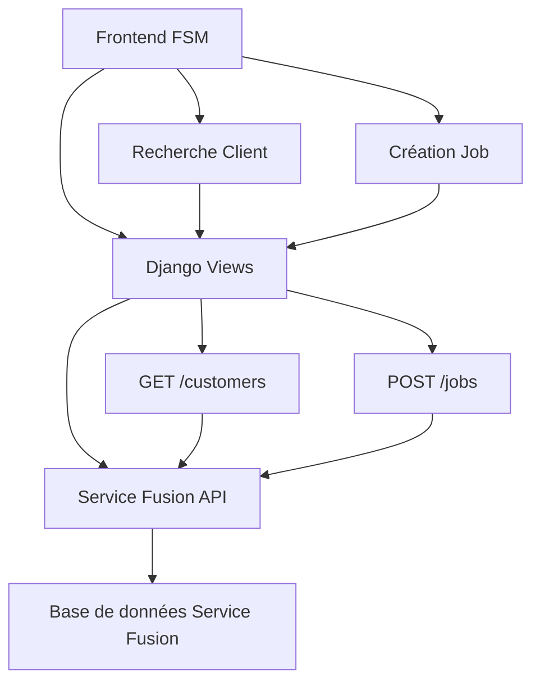

# BlueCollar.io - Field Service Management Platform

## 📋 Vue d'ensemble

BlueCollar.io est une plateforme de gestion de services sur le terrain (FSM) construite avec Django, qui intègre l'API Service Fusion pour la création et la gestion des commandes de travail. Le projet permet aux agents de centre d'appels de créer rapidement des jobs pour les clients existants avec préremplissage automatique des données.

## 🏗️ Architecture du Projet

### Structure des Dossiers

```
blucollar.io/
├── config/                          # Configuration Django
│   ├── __init__.py
│   ├── settings.py                  # Paramètres Django (sans DB)
│   ├── urls.py                      # URLs principales
│   ├── wsgi.py
│   └── asgi.py
├── fusion/                          # Application Django principale
│   ├── __init__.py
│   ├── views.py                     # Vues et endpoints API
│   ├── urls.py                      # URLs de l'app
│   ├── models.py                    # Modèles (non utilisés)
│   ├── admin.py
│   ├── apps.py
│   └── tests.py
├── templates/                       # Templates Django
│   ├── index.html                   # Page d'accueil
│   ├── fsm_platform.html           # Plateforme FSM principale
│   └── Ecotrak+SF-api_payload_mapping.html  # Mapping API
├── static/                          # Assets statiques
│   ├── css/
│   │   ├── fsm_platform.css        # Styles FSM
│   │   └── mapping.css              # Styles mapping
│   ├── js/
│   │   ├── fsm_platform.js         # Logique FSM
│   │   └── mapping.js               # Logique mapping
│   └── img/                         # Images
├── venv/                            # Environnement virtuel Python
├── manage.py                        # Script de gestion Django
├── requirements.txt                 # Dépendances Python
├── .env.example                     # Exemple de configuration
└── README.md                        # Ce fichier
```

## 🔧 Configuration

### Prérequis

- Python 3.8+
- pip
- Compte Service Fusion avec API Key

### Dépendances

Le projet utilise les packages Python suivants (voir `requirements.txt`) :

- **Django 5.2.6** : Framework web principal
- **python-dotenv 1.1.1** : Gestion des variables d'environnement
- **requests 2.32.5** : Client HTTP pour les appels API Service Fusion

### Installation

1. **Cloner le projet**
   ```bash
   git clone https://github.com/issouf-fofana/blucollar.io.git
   cd blucollar.io
   ```

2. **Créer l'environnement virtuel**
   ```bash
   python -m venv venv
   ```

3. **Activer l'environnement virtuel**
   ```bash
   # Windows
   venv\Scripts\activate
   
   # Linux/Mac
   source venv/bin/activate
   ```

4. **Installer les dépendances**
   ```bash
   pip install -r requirements.txt
   ```

5. **Configuration des variables d'environnement**
   ```bash
   copy .env.example .env
   ```
   
   Modifier `.env` avec vos vraies valeurs :
   ```env
   SERVICE_FUSION_BASE_URL=https://api.servicefusion.com
   SERVICE_FUSION_API_KEY=votre_cle_api_ici
   SERVICE_FUSION_COMPANY_ID=votre_company_id_ici
   SECRET_KEY=votre_secret_key_django
   DEBUG=True
   ALLOWED_HOSTS=localhost,127.0.0.1,0.0.0.0
   ```

6. **Démarrer le serveur**
   ```bash
   python manage.py runserver
   ```

## 🌐 URLs et Navigation

| URL | Description | Fonctionnalité |
|-----|-------------|----------------|
| `/` | Page d'accueil | Navigation vers les modules |
| `/fsm/` | Plateforme FSM | Création de jobs pour clients existants |
| `/mapping/` | Mapping API | Documentation du mapping Ecotrack → Service Fusion |
| `/api/fusion/customers/search` | Recherche clients | API de recherche de clients Service Fusion |
| `/api/fusion/jobs/create` | Création job | API de création de jobs Service Fusion |

## 🔌 Architecture API

### Flux de Données



### Endpoints Django

#### 1. Recherche de Clients
```http
GET /api/fusion/customers/search?q=nom_client
```

**Paramètres :**
- `q` : Terme de recherche (minimum 2 caractères)

**Réponse :**
```json
[
  {
    "id": "12345",
    "name": "Snuffers Restaurant Group",
    "customer_name": "Snuffers Restaurant Group",
    "locations": [
      {
        "name": "Snuffers - Rockwall",
        "address": "777 S Central Expy",
        "city": "Richardson",
        "state": "TX",
        "zip": "75080-7400"
      }
    ],
    "contacts": [
      {
        "name": "Nicole Forga",
        "phone": "+1 555 0100",
        "email": "ops@snuffers.com"
      }
    ]
  }
]
```

#### 2. Création de Job
```http
POST /api/fusion/jobs/create
```

**Payload :**
```json
{
  "customer_id": "12345",
  "customer_name": "Snuffers Restaurant Group",
  "service_location": {
    "name": "Snuffers - Rockwall",
    "address": "777 S Central Expy",
    "city": "Richardson",
    "state": "TX",
    "zip": "75080-7400"
  },
  "category": "Refrigeration",
  "priority": "Normal",
  "problem_details": "Freezer not maintaining temperature...",
  "contact": {
    "name": "Nicole Forga",
    "phone": "+1 555 0100",
    "email": "ops@snuffers.com"
  }
}
```

## 🎯 Fonctionnalités Principales

### 1. Recherche et Sélection de Clients

- **Recherche en temps réel** : Tapez le nom du client pour voir les suggestions
- **Autocomplétion** : Suggestions avec nom, ID, ville et état
- **Préremplissage automatique** : Tous les champs se remplissent automatiquement

### 2. Création de Jobs

- **Wizard en 5 étapes** :
  1. Recherche et sélection du client
  2. Localisation et priorité du service
  3. Adresse du service
  4. Description détaillée et contact
  5. Fenêtre de temps préférée

- **Validation** : Champs obligatoires validés à chaque étape
- **Intégration Service Fusion** : Création directe dans Service Fusion

### 3. Interface Utilisateur

- **Design moderne** : Interface responsive avec thème sombre/clair
- **Navigation intuitive** : Sidebar avec modules principaux
- **Feedback visuel** : Toasts, modales de confirmation, barre de progression

## 🔄 Mapping des Données

### Ecotrack → Service Fusion

Le projet inclut un mapping détaillé des champs entre Ecotrack et Service Fusion :

| Ecotrack | Service Fusion | Transformation |
|----------|----------------|----------------|
| `work_order.customer.customer_name` | `customer_name` | Direct |
| `work_order.priority_type` | `priority` | "L2 - Same Day" → "Normal" |
| `work_order.location.address1` | `street_1` | Direct |
| `work_order.location.city` | `city` | Direct |
| `work_order.location.state` | `state_prov` | Direct |
| `work_order.location.zip` | `postal_code` | Direct |
| `work_order.asset_type_name` | `category` | Direct |
| `work_order.description` | `description` | Direct |

## 🛠️ Développement

### Structure du Code

#### Frontend (JavaScript)
- **Modularité** : Fonctions séparées par responsabilité
- **API abstraite** : Helpers pour les appels HTTP
- **Gestion d'état** : Variables globales pour l'état de l'application
- **UX** : Gestion des erreurs et feedback utilisateur

#### Backend (Django)
- **Vues simples** : Fonctions de vue sans complexité inutile
- **Proxy API** : Transparent pour le frontend
- **Gestion d'erreurs** : Retour d'erreurs structurées
- **Configuration** : Variables d'environnement pour la flexibilité

### Ajout de Nouvelles Fonctionnalités

1. **Nouveau endpoint API** :
   - Ajouter la route dans `fusion/urls.py`
   - Créer la vue dans `fusion/views.py`
   - Tester avec l'API Service Fusion

2. **Nouvelle page** :
   - Créer le template dans `templates/`
   - Ajouter les styles dans `static/css/`
   - Ajouter la logique dans `static/js/`
   - Créer la vue et l'URL

## 🚀 Déploiement

### Production

1. **Variables d'environnement** :
   ```env
   DEBUG=False
   SECRET_KEY=cle_secrete_production
   ALLOWED_HOSTS=votre-domaine.com
   ```

2. **Collecte des fichiers statiques** :
   ```bash
   python manage.py collectstatic
   ```

3. **Serveur web** : Utiliser Gunicorn ou uWSGI avec Nginx

### Docker (Optionnel)

```dockerfile
FROM python:3.11-slim
WORKDIR /app
COPY requirements.txt .
RUN pip install -r requirements.txt
COPY . .
CMD ["gunicorn", "config.wsgi:application"]
```

### Mise à jour des dépendances

Pour mettre à jour les dépendances :

```bash
# Activer l'environnement virtuel
venv\Scripts\activate  # Windows
source venv/bin/activate  # Linux/Mac

# Mettre à jour requirements.txt
pip freeze > requirements.txt

# Ou installer une nouvelle dépendance
pip install nouvelle-dependance
pip freeze > requirements.txt
```

## 📚 Documentation API Service Fusion

- [Documentation officielle](https://docs.servicefusion.com/)
- [Types de données](https://docs.servicefusion.com/#/docs/types-38)
- [Méthodes et ressources](https://docs.servicefusion.com/#/docs/resources-0-methods-0)

## 🤝 Contribution

1. Fork le projet
2. Créer une branche feature (`git checkout -b feature/nouvelle-fonctionnalite`)
3. Commit les changements (`git commit -am 'Ajouter nouvelle fonctionnalité'`)
4. Push vers la branche (`git push origin feature/nouvelle-fonctionnalite`)
5. Créer une Pull Request

## 📄 Licence

Ce projet est sous licence MIT. Voir le fichier `LICENSE` pour plus de détails.

## 🆘 Support

Pour toute question ou problème :
- Créer une issue sur GitHub
- Contacter l'équipe de développement
- Consulter la documentation Service Fusion

---

**Développé avec ❤️ par l'équipe BlueCollar.io**